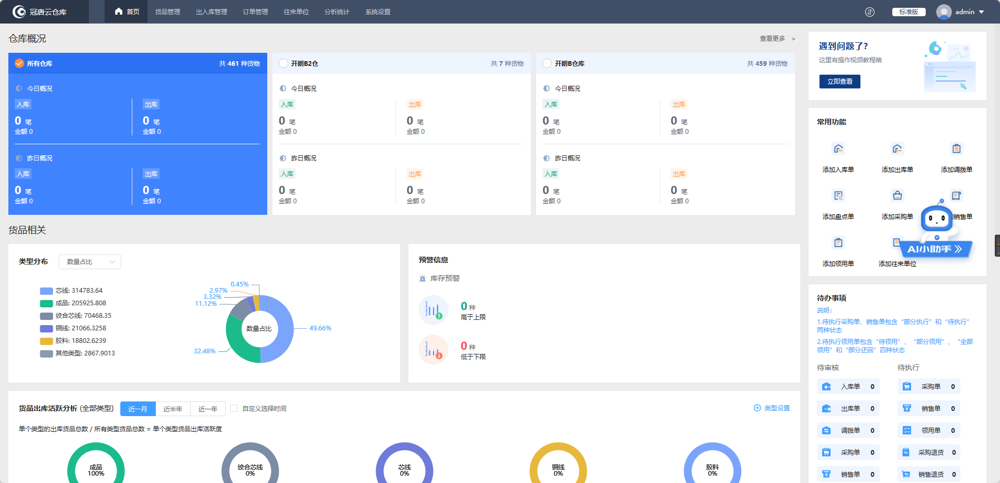
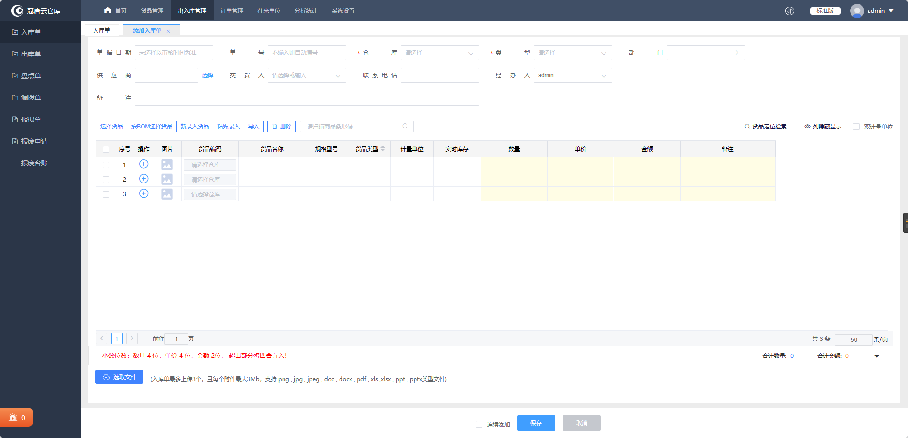
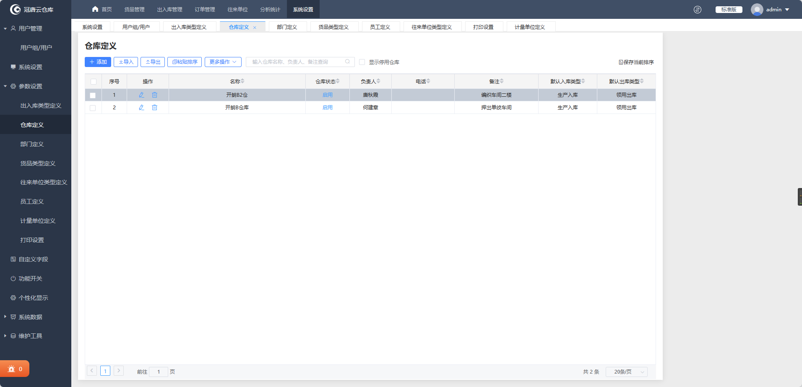
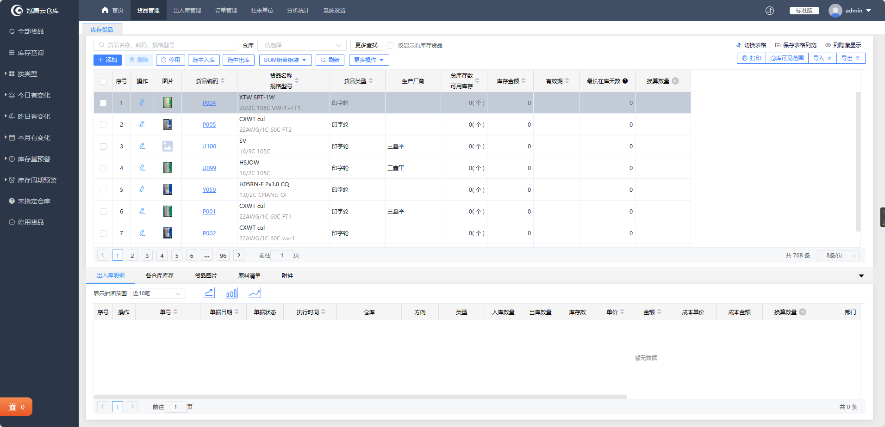

<p align="center">
	
</p>
<h1 align="center" style="margin: 30px 0 30px; font-weight: bold;">Go-SimpleWMS</h1>
<div align="center"> 

[简体中文](./README.md)/English
</div>
<h4 align="center">A Warehouse Management System based on gin+Vue3 for Front-end and Back-end Separation</h4>

<div align="center">


</div>

## Introduction

* Front-end stack: [Vue3](https://v3.vuejs.org/) + [Element Plus](https://element-plus.org/en-US/) + [Vite](https://vitejs.dev/).
* Back-end: [gin](https://gin-gonic.com/en/) + [gorm](https://gorm.io/docs/index.html).
* Database: [MySQL](https://www.mysql.com/).

## Front-end Setup

```bash
# Clone the project
git clone https://github.com/LanceHE6/Go-SimpleWMS.git

# Enter the project directory
cd vue-web

# Install dependencies
npm install

# Start the service
npm run dev

# Front-end access address: http://localhost:80
```

## Back-end Setup

```bash
# Enter the project directory
cd go-server

# Download dependencies
go mod download

# Build the project
go build -o main .
```

## Built-in Features

### Permission Groups

#### Regular User

* Browse information

#### Administrator

* Add and update products
* Add and update inventory and outbound orders

#### Super Administrator

* Full CRUD permissions

### Management

* User Management
* Department Management
* Measurement Unit Management
* Warehouse Management
* Employee Management
* Inventory Type Management
* Product Management
* Product Type Management
* Inventory and Outbound Order Management

## Backend API Documentation

[API Documentation](./go-server/README.md)

## Online Preview

[Go-SimpleWMS](https://lancehe6.github.io/Go-SimpleWMS/)

## Expected Outcome Screenshots







