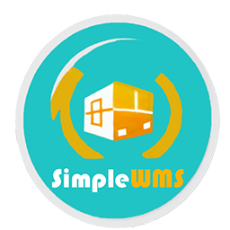
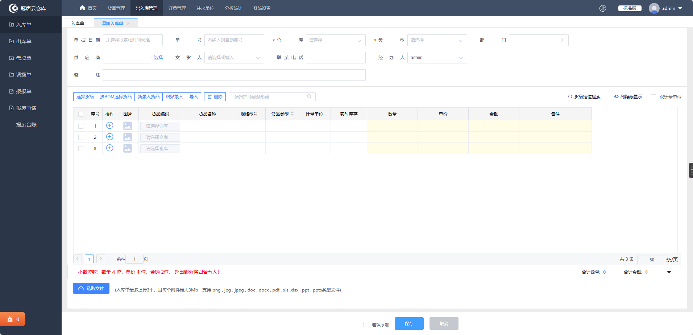
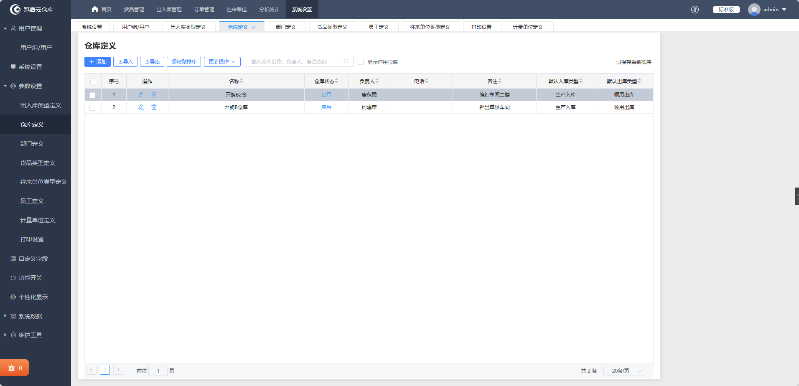
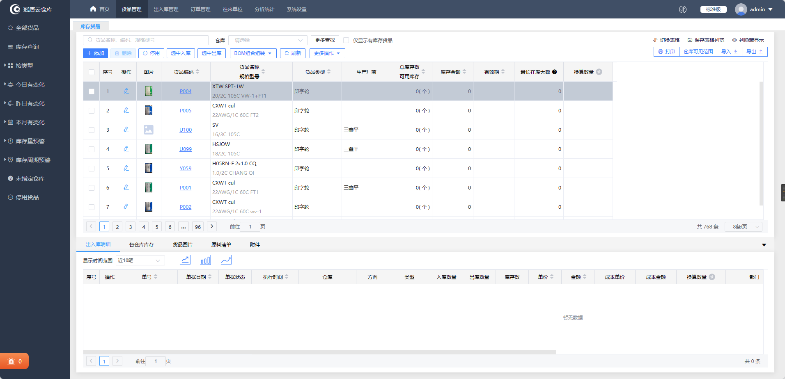

<p align="center">
	
</p>
<h1 align="center" style="margin: 30px 0 30px; font-weight: bold;">Go-SimpleWMS</h1>
<h4 align="center">基于gin+Vue3前后端分离的仓库管理系统</h4>

<div align="center">


</div>


## 平台简介

* 前端技术栈 [Vue3](https://v3.cn.vuejs.org) + [Element Plus](https://element-plus.org/zh-CN) + [Vite](https://cn.vitejs.dev) 。
* 后端[gin](https://gin-gonic.com/zh-cn/)+[gorm](https://gorm.io/zh_CN/docs/index.html)。
* 数据库[mysql]([MySQL](https://www.mysql.com/cn/))。

## 前端运行

```bash
# 克隆项目
git clone https://github.com/LanceHE6/Go-SimpleWMS.git

# 进入项目目录
cd vue-web

# 安装依赖
npm install

# 启动服务
npm run dev

# 前端访问地址 http://localhost:80
```

## 后端运行

```bash
# 进入项目目录
cd go-server

# 下载依赖
go mod download

# 构建项目
go build -o main .
```


## 内置功能

### 权限组

#### 普通用户

* 浏览信息

#### 管理员

* 货品添加，更新
* 出入库单添加，更新

#### 超级管理员

* 所有增删改查权限

### 管理

* 用户管理

* 部门管理

* 计量单位管理

* 仓库管理

* 员工管理

* 出入库类型管理

* 货品管理

* 货品类型管理

* 出入库订单管理


## 后端接口文档

[接口文档](./go-server/README.md)


## 在线预览

[Go-SimpleWMS](https://lancehe6.github.io/Go-SimpleWMS/)


## 对标预期效果









